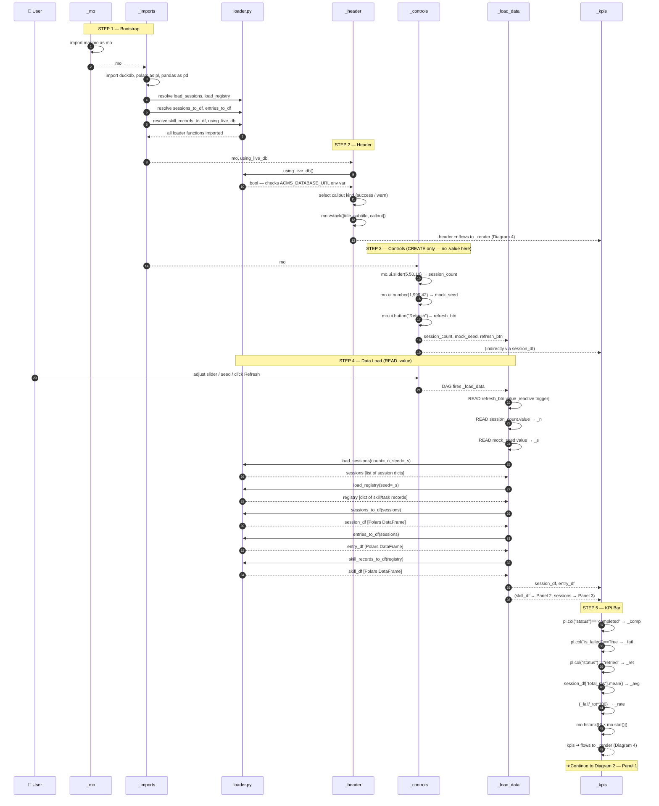
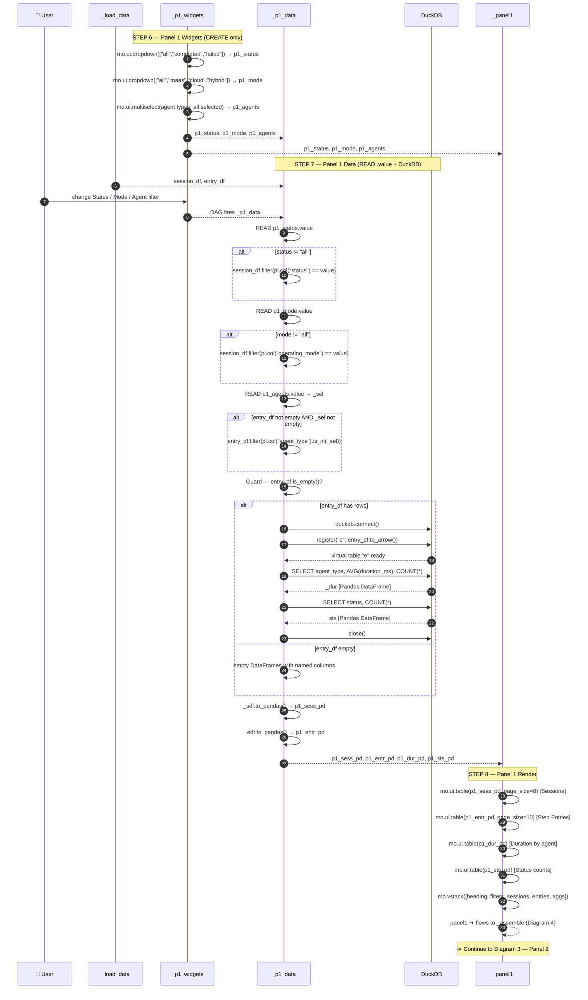
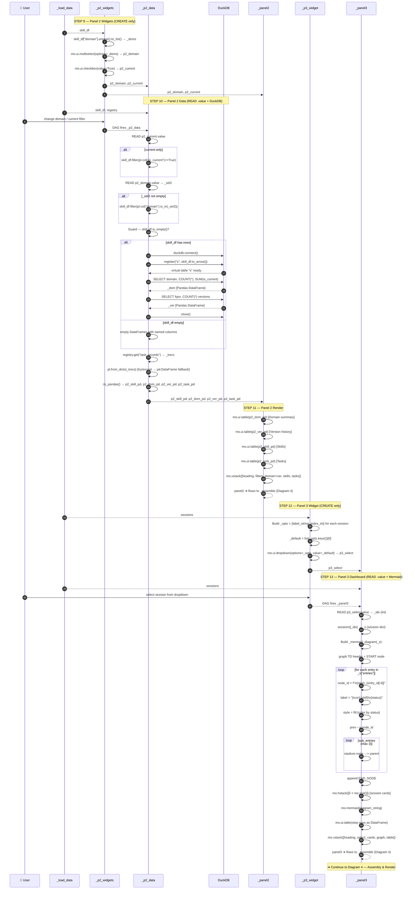
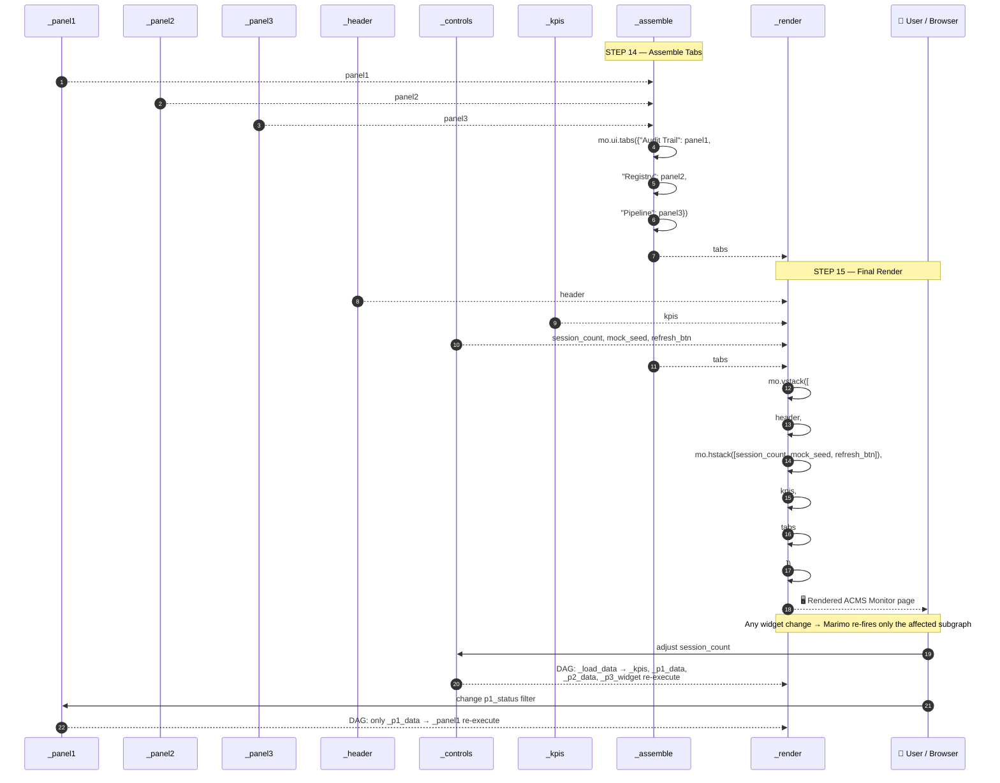
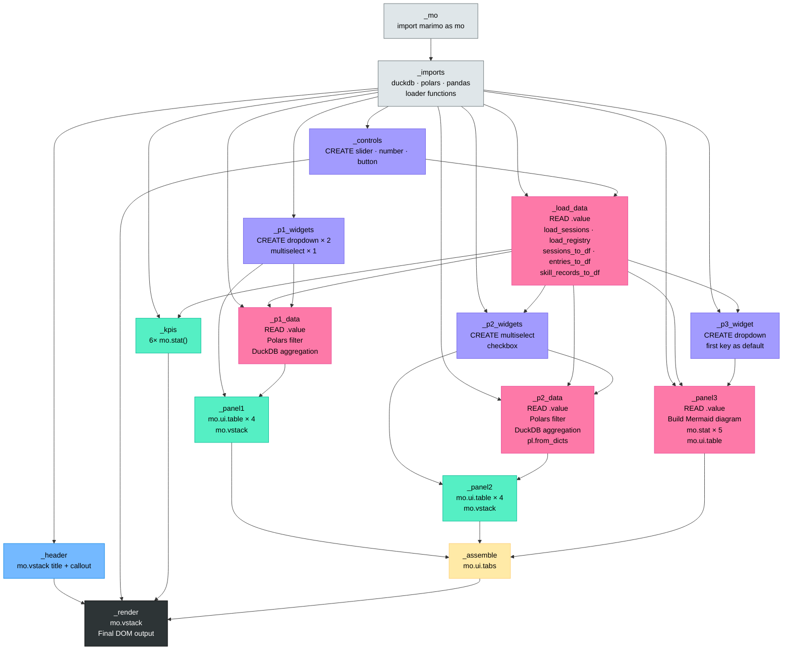

# ACMS Monitor — Cell Execution Sequence Diagrams

**Mind Over Metadata LLC — Peter Heller**
`QCadjunct/acms-langgraph-poc` · `ui/acms_monitor.py`

> Four diagrams, each a link in the chain. Read top to bottom.
> **Diagram 1 → 2 → 3 → 4** — each picks up where the previous left off.

---

## Diagram 1 of 4 — Bootstrap & Data Load

*Covers: `_mo`, `_imports`, `_header`, `_controls`, `_load_data`, `_kpis`*

---

## Diagram 2 of 4 — Panel 1: Audit Trail Explorer

*Picks up after `_load_data`. Covers: `_p1_widgets`, `_p1_data`, `_panel1`*

---

## Diagram 3 of 4 — Panel 2 & Panel 3

*Picks up after `_load_data`. Covers: `_p2_widgets`, `_p2_data`, `_panel2`, `_p3_widget`, `_panel3`*

---

## Diagram 4 of 4 — Assembly & Render

*Picks up after Panels 1, 2, 3. Covers: `_assemble`, `_render`*

---

## Cell Dependency Map

**Color key:**
- ⬜ Grey — bootstrap / imports
- 🔵 Blue — header (read-only render)
- 🟣 Purple — CREATE widget cells
- 🔴 Pink — READ `.value` + data cells
- 🟢 Green — panel render cells
- 🟡 Yellow — assembly
- ⬛ Black — final DOM output

---

*© 2026 Mind Over Metadata LLC — Peter Heller. All rights reserved.*
