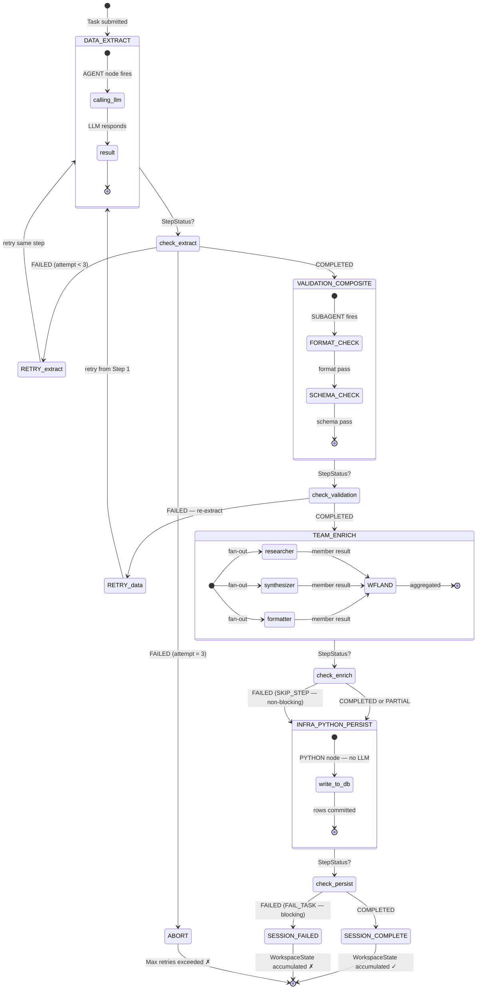
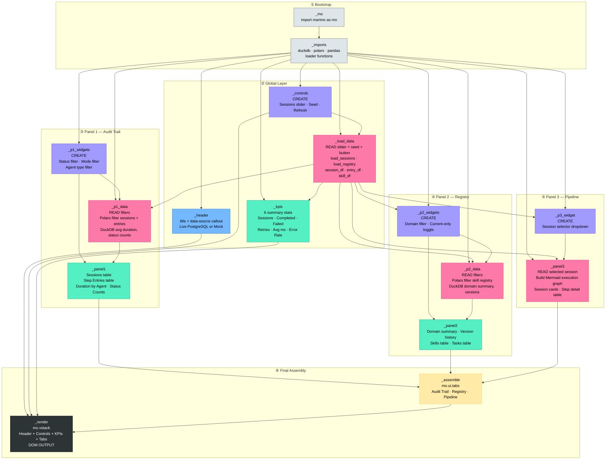
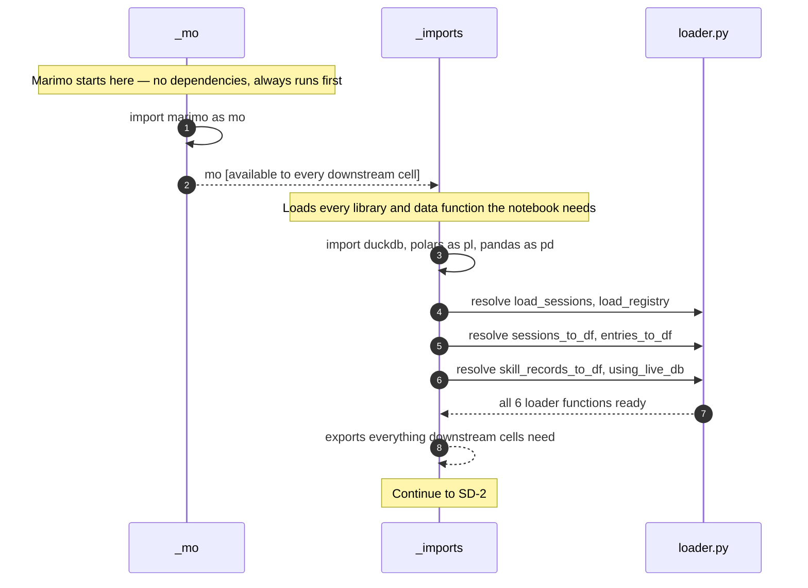
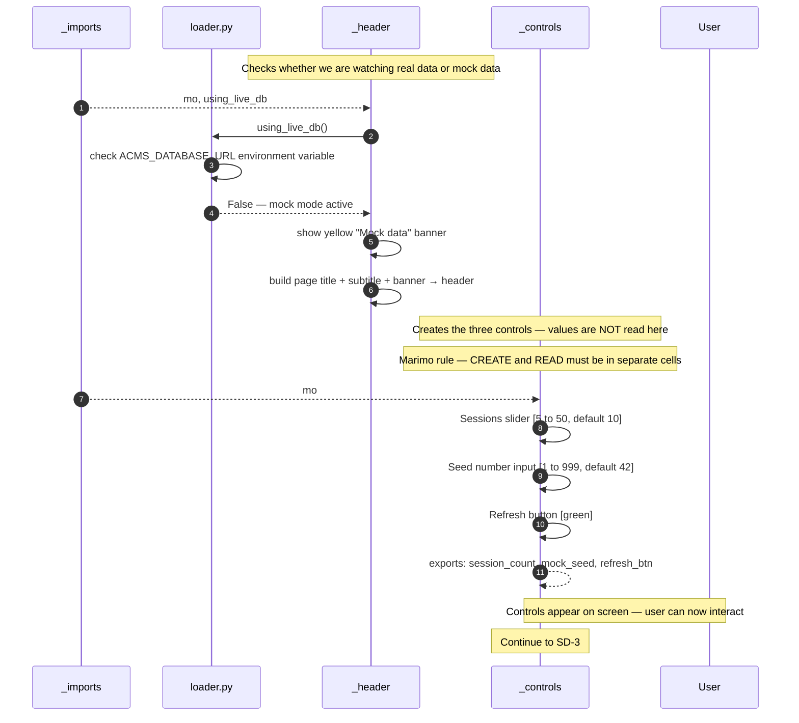
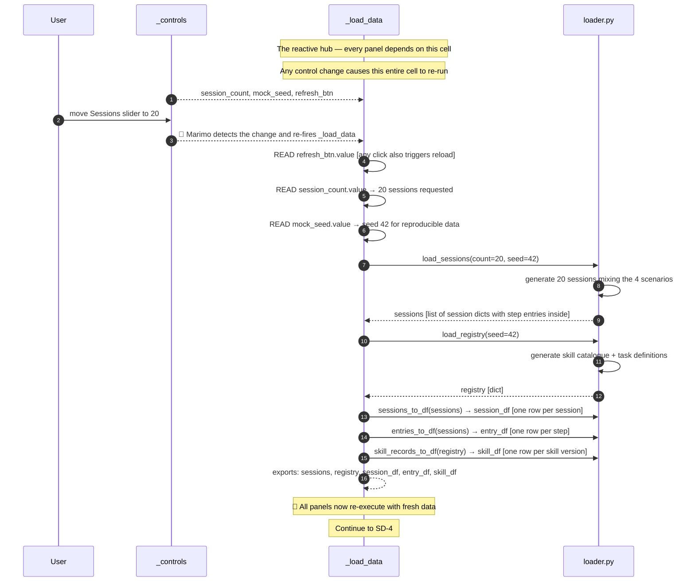
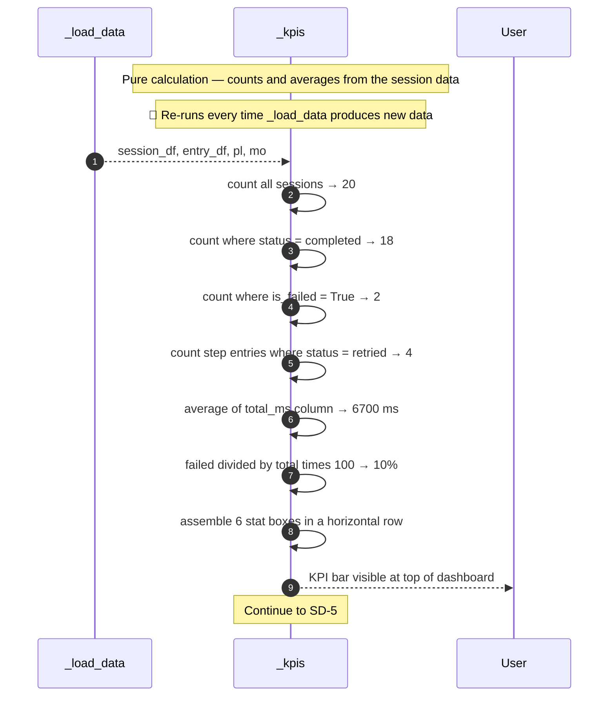
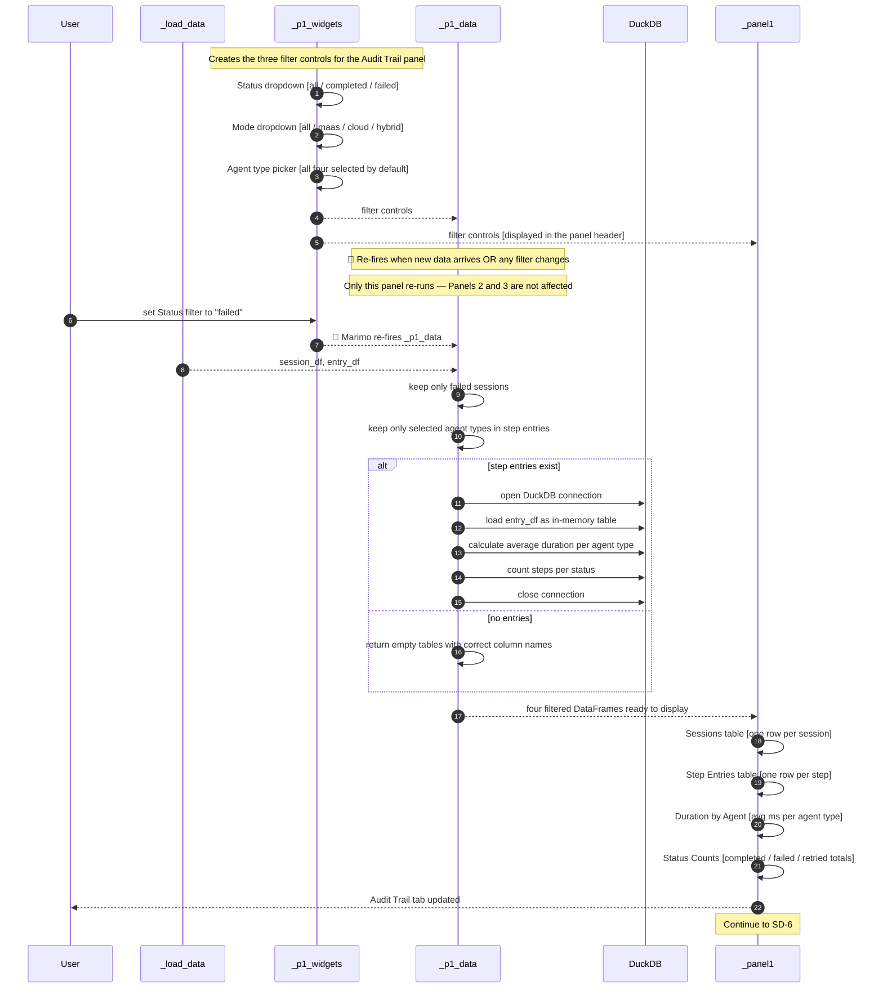
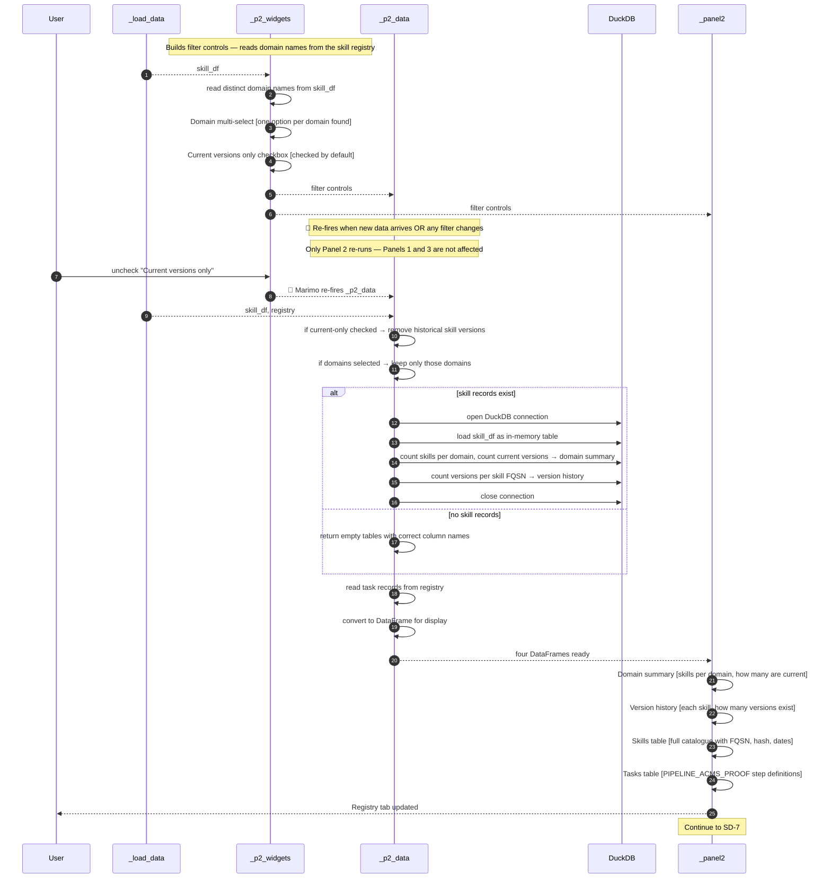
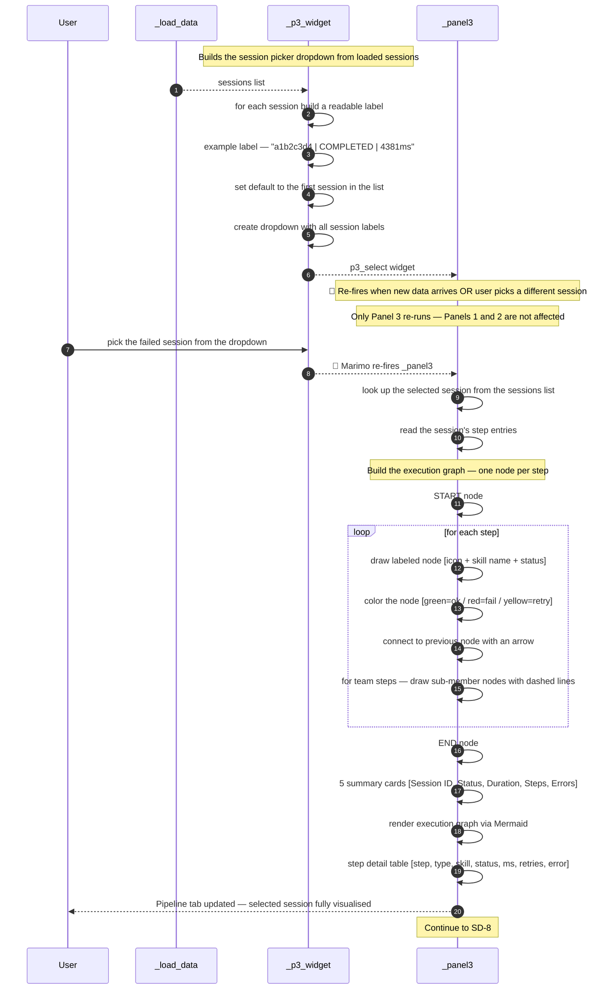
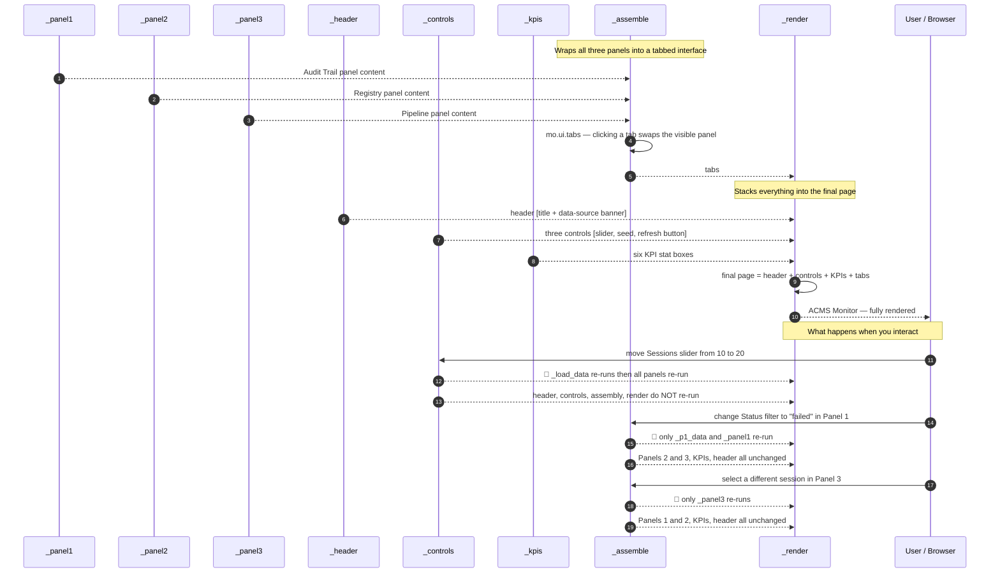

# ACMS Monitor — What It Shows and How It Works

**Mind Over Metadata LLC — Peter Heller**
`QCadjunct/acms-langgraph-poc` · `ui/acms_monitor.py`

---

## What Is the ACMS Monitor?

The ACMS Monitor is a live dashboard that watches **AI agent pipelines execute in real time**.
It is the modern equivalent of the DEC ACMS console — the operator screen that showed every
task running on a VAX cluster, its status, its step sequence, and whether it succeeded or failed.

The pipeline it monitors is called **PIPELINE_ACMS_PROOF** — a proof-of-concept that demonstrates
all four agent types working together inside a LangGraph workflow:

| Agent Type | What It Does |
|---|---|
| **AGENT** | Single AI call — one skill, one system prompt, one answer |
| **SUBAGENT** | A mini-pipeline — runs two skills back-to-back as one atomic unit |
| **TEAM** | Parallel workers — three AI agents run simultaneously, results merged |
| **PYTHON** | Pure code — no AI, deterministic, but fully audited like the others |

---

## The Pipeline This Monitor Watches

### PIPELINE_ACMS_PROOF — Four Steps, Four Agent Types

### The Four Execution Scenarios in the Mock Data

| Scenario | What Happens | Final Status |
|---|---|---|
| **Happy path** | All four steps complete first try | ✅ COMPLETED |
| **Retry then success** | Step 1 fails, retries twice, then succeeds | ✅ COMPLETED |
| **Team partial fail** | One of three team members times out — pipeline continues | ✅ COMPLETED |
| **Hard failure** | Step 4 (database write) fails — entire session aborted | ❌ FAILED |

### WorkspaceState — The Accumulator

Every step appends its result to the **WorkspaceState**. It never overwrites — it only grows.
This is the D⁴ invariant: `Annotated[list[WorkspaceEntry], operator.add]`.
The Monitor reads this accumulated state to build every table and diagram you see.

---

## What Each Panel Shows

### Panel 1 — Audit Trail Explorer

**Plain English:** "Show me every session that ran and every step inside it."

This panel is the session logbook. Every time the pipeline runs — whether it succeeded,
failed, or retried — a session record is written. The Audit Trail lets you:

- **Filter sessions** by outcome (completed / failed) and operating mode
- **Filter steps** by agent type (Agent, SubAgent, Team, Python)
- **See aggregations** — which agent type takes longest on average, how many steps retried

Think of it as the VAX operator console audit log. If something went wrong, this is where
you find it.

| Table | What It Shows |
|---|---|
| **Sessions** | One row per pipeline run — ID, status, duration, error count |
| **Step Entries** | One row per step per session — which skill, which agent, how long, retry count |
| **Duration by Agent** | Average milliseconds per agent type — where is time being spent? |
| **Status Counts** | How many steps completed / failed / retried across all sessions |

---

### Panel 2 — Registry Analytics

**Plain English:** "Show me what skills and tasks are registered and their version history."

The Registry is the ACMS equivalent of the Application Definition File (ADF) —
the catalogue of every skill (HOW to do something) and every task (WHAT to do).
Skills are versioned. Only one version is "current" at a time.

This panel lets you:

- **Filter by domain** — see only Data skills, or only Validation skills
- **Toggle current-only** — hide historical versions, show only what is active
- **Track version history** — how many times has a skill been updated?

| Table | What It Shows |
|---|---|
| **Domain summary** | How many skills exist per domain, how many are current |
| **Version history** | Each skill FQSN and how many versions exist in the registry |
| **Skills** | Full skill catalogue — FQSN path, version, hash, valid-from/valid-to dates |
| **Tasks** | Task registry — PIPELINE_ACMS_PROOF and its step definitions |

---

### Panel 3 — Pipeline Dashboard

**Plain English:** "Show me one session's complete execution as a diagram."

Pick any session from the dropdown and this panel draws its execution graph —
the actual path the pipeline took through the four steps, color-coded by outcome.
Below the graph is a step-by-step table with timing, retry counts, and error messages.

This is the ACMS Monitor's main screen — the equivalent of watching a task execute
in the VAX ACMS console in real time, step by step.

**Execution graph color key:**

| Color | Meaning |
|---|---|
| 🟢 Green | Step completed successfully |
| 🔴 Red | Step failed |
| 🟡 Yellow | Step was retried |
| ⬜ Grey | Step was skipped (non-blocking) |

**Node icons:**

| Icon | Agent Type | Meaning |
|---|---|---|
| `A` | AGENT | Single LLM call |
| `S` | SUBAGENT | Sequential sub-pipeline |
| `T` | TEAM | Parallel fan-out workers |
| `P` | PYTHON | Deterministic code, no LLM |

---

## Cell Dependency Map — How Marimo Wires the Dashboard Together

**Color key:** 🔘 Grey = bootstrap · 🔵 Blue = render-only · 🟣 Purple = CREATE widget
🔴 Pink = READ + compute · 🟢 Green = panel render · 🟡 Yellow = assemble · ⬛ Black = DOM

**Marimo reactive rule:** Move the Sessions slider and only the pink and green cells
downstream of `_load_data` re-execute. Change a Panel 1 filter and only `_p1_data`
and `_panel1` re-run. Nothing else executes. This is the DAG.

---

## Sequence Diagrams — 8-Part Chain

> Step numbers run continuously 1 through 15 across all 8 diagrams.
> **🔁** marks a Marimo reactive re-fire — only the subgraph downstream of the change re-runs.

---

### SD-1 of 8 — Bootstrap

---

### SD-2 of 8 — Header & Controls

---

### SD-3 of 8 — Data Load

---

### SD-4 of 8 — KPI Bar

---

### SD-5 of 8 — Panel 1: Audit Trail Explorer

---

### SD-6 of 8 — Panel 2: Registry Analytics

---

### SD-7 of 8 — Panel 3: Pipeline Dashboard

---

### SD-8 of 8 — Assembly & Render

---

*© 2026 Mind Over Metadata LLC — Peter Heller. All rights reserved.*
